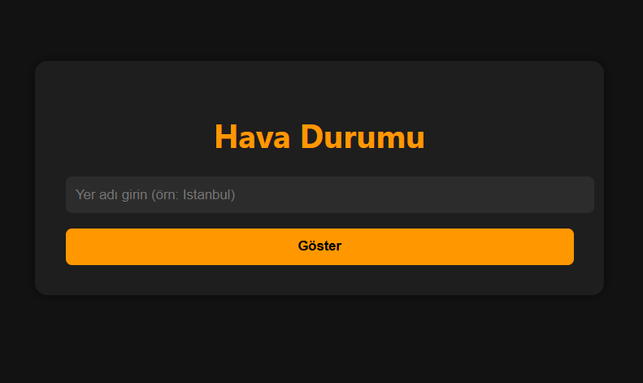
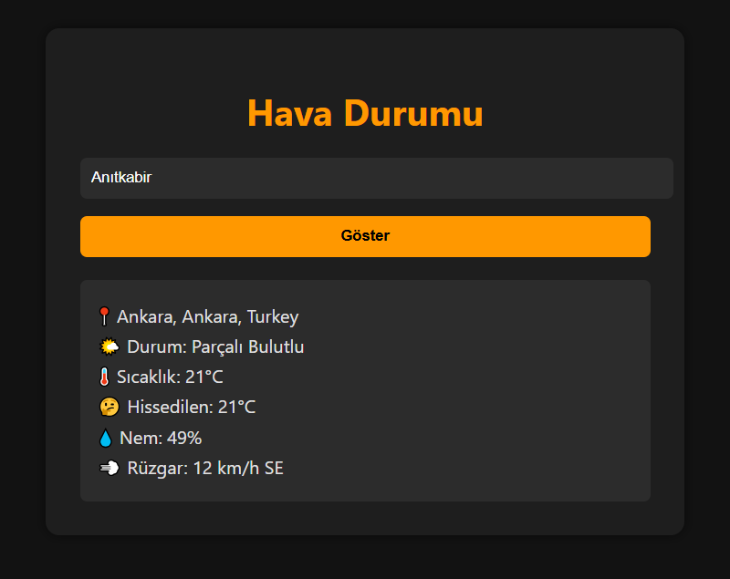

# 🌦️ Hava Durumu Web Uygulaması

**Basit ve şık bir hava durumu uygulaması!**
Kullanıcıdan yer bilgisi alır, anlık hava durumu verilerini wttr.in API'si üzerinden getirir ve görsel olarak sunar. Tamamen HTML, CSS ve JavaScript kullanılarak geliştirilmiştir.

---

## 📸 Ekran Görüntüleri

**Uygulama Başlangıç Ekranı:**

**Veri Geldikten Sonraki Hali:**

---

## 🚀 Özellikler

- 🌍 Yer ismi girerek anlık hava durumu öğrenme
- 🌀 Yükleniyor animasyonu (spinner) ile şık kullanıcı deneyimi
- 🎨 Karanlık tema uyumlu tasarım
- 🔥 Sıcaklık, hissedilen sıcaklık, nem ve rüzgar bilgisi
- 📱 Mobil uyumlu arayüz

---

## 🛠️ Kullanılan Teknolojiler

- HTML5
- CSS3
- JavaScript (Vanilla)
- API: [wttr.in](https://wttr.in)

---

## 📦 Nasıl Kullanılır?

1. Projeyi indir veya klonla:
 `git clone https://github.com/aliegesazak/hava-durumu.git`

2. `index.html` dosyasını bir tarayıcıda aç.
3. Bir yer ismi gir ve "Göster" butonuna tıkla.
4. Anlık hava durumu bilgisi ekrana gelsin!
5. Bunları yapmadan kişisel websitemden test edebilirsin -> [Hava Durumu](https://aliegesazak.com/hava-durumu)

---

## 🔐 Notlar

- API, ücretsiz ve oturum gerektirmeyen bir servistir. Ancak fazla istek gönderildiğinde sınırlamaya girebilir.
- Uygulama tamamen istemci tarafında çalışır. Ek bir sunucuya ihtiyaç yoktur.

---

## 📄 Lisans

Bu proje MIT lisansı ile lisanslanmıştır. Dilediğiniz gibi kullanabilir, geliştirebilir veya paylaşabilirsiniz.

---

## ✨ Katkıda Bulun

Yeni fikirlerin mi var? PR’lara açığım! İstersen iletişime geçebilirsin. 🌱
